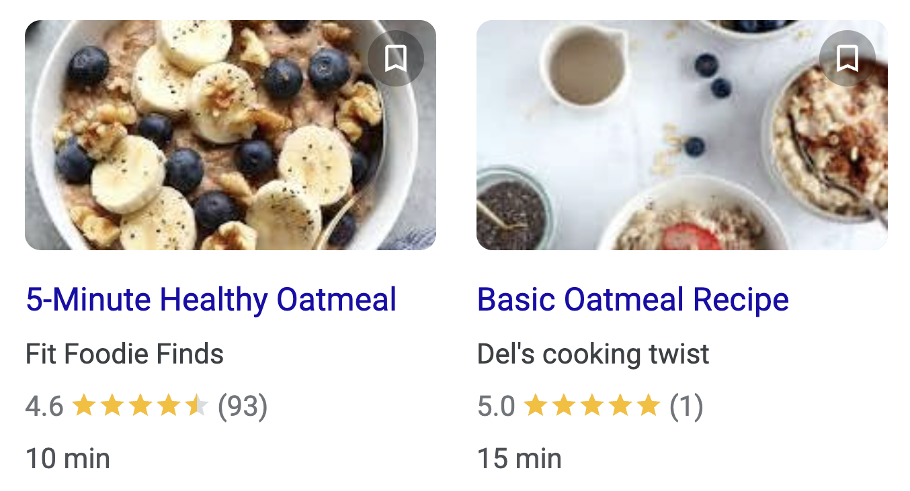
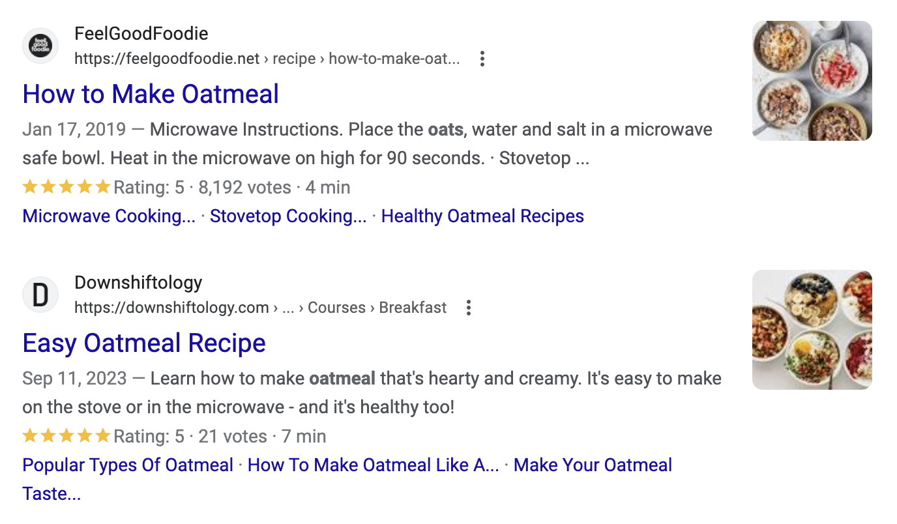
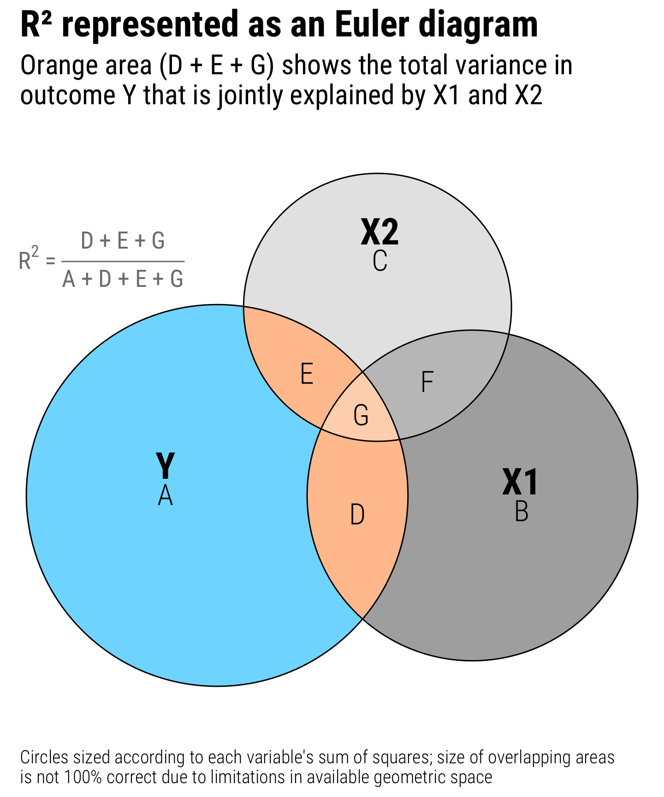
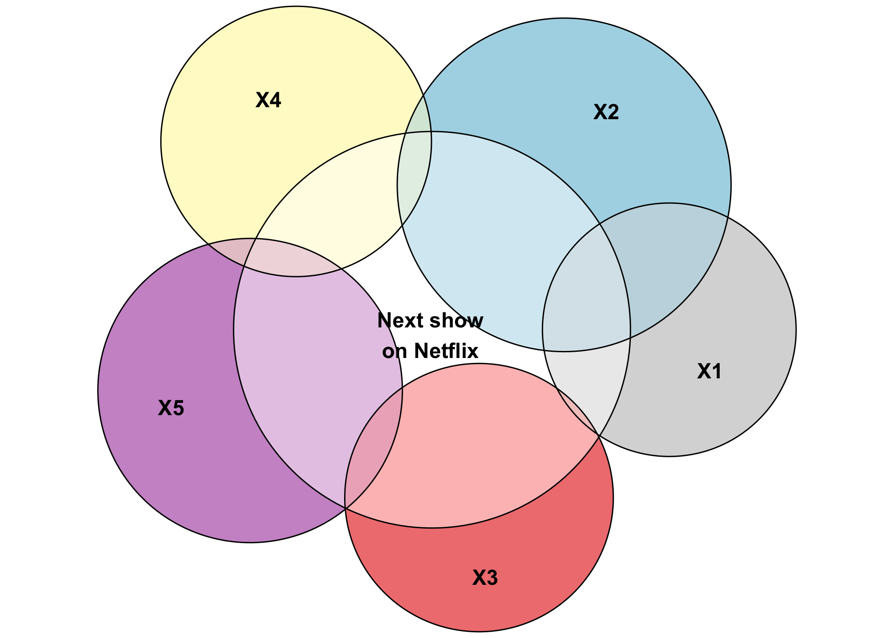

```{r setup, include=FALSE}
knitr::opts_chunk$set(warning = FALSE, message = FALSE, 
                      fig.retina = 3, fig.align = "center")
```

```{r packages-data, include=FALSE}
library(tidyverse)
library(broom)
library(patchwork)
```

```{r xaringanExtra, echo=FALSE}
xaringanExtra::use_xaringan_extra(c("tile_view"))
```

class: center middle main-title section-title-3

# In-person<br>session 2

.class-info[

**January 18, 2024**

.light[PMAP 8521: Program evaluation<br>
Andrew Young School of Policy Studies
]

]

---

name: outline
class: title title-inv-8

# Plan for today

--

.box-6.medium.sp-after-half[Files, folders, and projects]

--

.box-2.medium.sp-after-half[Transforming data with {dplyr}]

--

.box-1.medium[Regression, p-values, and null worlds]

---

layout: false
name: files-folders
class: center middle section-title section-title-6 animated fadeIn

# Files, folders,<br>and projects

---

layout: true
class: middle

---

.box-6.large[Why so much content<br>these first two weeks?]

???

Everything is a little scattered at the beginning because you're all coming from different backgrounds and skill levels. Some have been using R for months+years, some haven't. Some have been doing regression and stats for years, some haven't. So these first two weeks involve throwing a bunch of stuff at you and seeing what you'll take and what you need.

In the future, it'll be a lot more consolidated: content on the content page, assignment instructions on the assignments page, example walk through on the examples page. That's it. Content, assignment, example, over and over again.

---

.box-6.large[How much should I be reading?]

---

.box-6.large[File paths, working directories,<br>and RStudio projects]

???

- <https://www.theverge.com/22684730/students-file-folder-directory-structure-education-gen-z>
- Working directories and RStudio projects

---

.box-6.large[.zip files]

---

.box-6.large[The hyperliterality of computers]

.box-6.large[Warnings and messages]

---

.box-6.large[Quarto tips]

???

- Visual editor
- Citations - <https://zbib.org> + <https://zotero.org>
- Markdown metadata and outputs, figure sizes

---

layout: false
name: dplyr
class: center middle section-title section-title-2 animated fadeIn

# Transforming<br>data with {dplyr}

---

layout: false
name: ggplot
class: center middle section-title section-title-1 animated fadeIn

# Regression with R

---

layout: true
class: middle

---

.center[
<figure>
  
</figure>
]

.center.small[[From slides](https://evalsp24.classes.andrewheiss.com/slides/02-slides.html#39)]

---

.center[
<figure>
  
</figure>
]

---

.box-1.large[Regression equations]

.box-inv-1[And is the intercept ever useful,<br>or should we always ignore it?]

???

<https://evalsp24.classes.andrewheiss.com/slides/02-slides.html#38>

<https://www.andrewheiss.com/blog/2022/05/20/marginalia/#regression-sliders-switches-and-mixing-boards>

---

.box-1.medium.sp-after[Why use two steps to create a regression in R?<br>(i.e. assigning it to an object with `<-`?)]

.box-1.medium[Why use `tidy()`<br>from the broom package?]

???

Show model with `lm()`; show t-test with `t.test()`; show both through `tidy()`

Use **marginaleffects**

---

.box-1.medium[How was the 0.05 significance<br>threshold determined?] 

.box-1.medium[Could we say something is significant<br>if p > 0.05, but just note that it is at<br>a higher p-value?<br>Or does it have to fall under 0.05?]

---

.box-1.large[Why all this convoluted<br>logic of null worlds?]

---

.center[
<figure>
  
</figure>
]


---

.center[
<figure>
  
</figure>
]

---

layout: true
class: middle

---

.box-1.medium[Do we care about the actual coefficients<br>or just whether or not they're significant?]

.box-1.medium[How does significance relate to causation?]

.box-1.medium[If we can't use statistics to assert causation<br>how are we going to use this information<br>in program evaluation?]

---

.box-1.large[What counts as a "good" R²?]

---

.center[
<figure>
  
</figure>
]

---

.center[
<figure>
  
</figure>
]

---

.center[
<figure>
  
</figure>
]

---

.center[
<figure>
  
</figure>
]

---

.box-1.huge[R time!]
